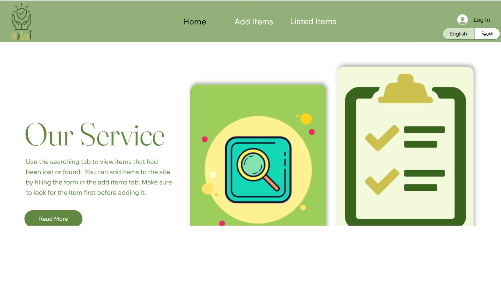
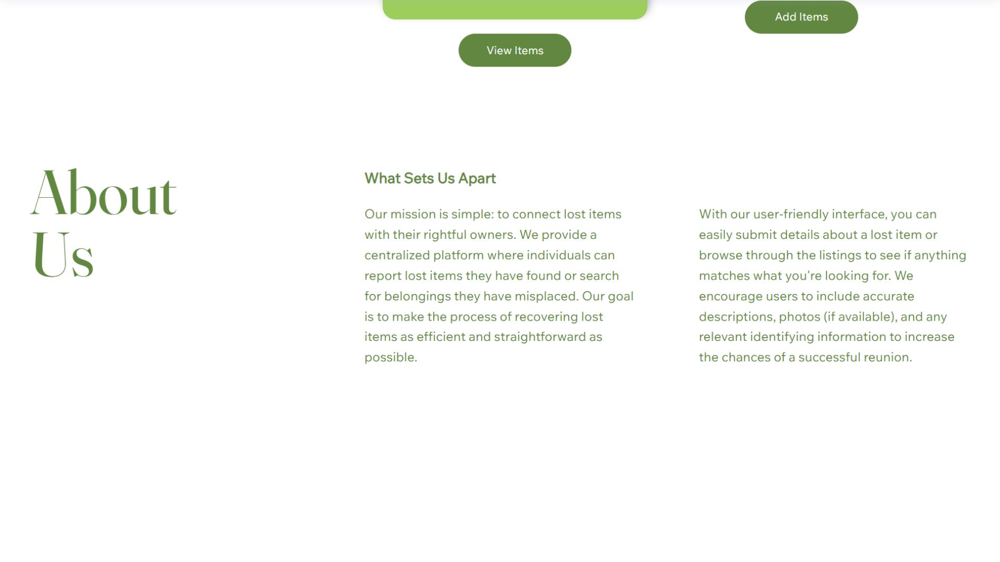
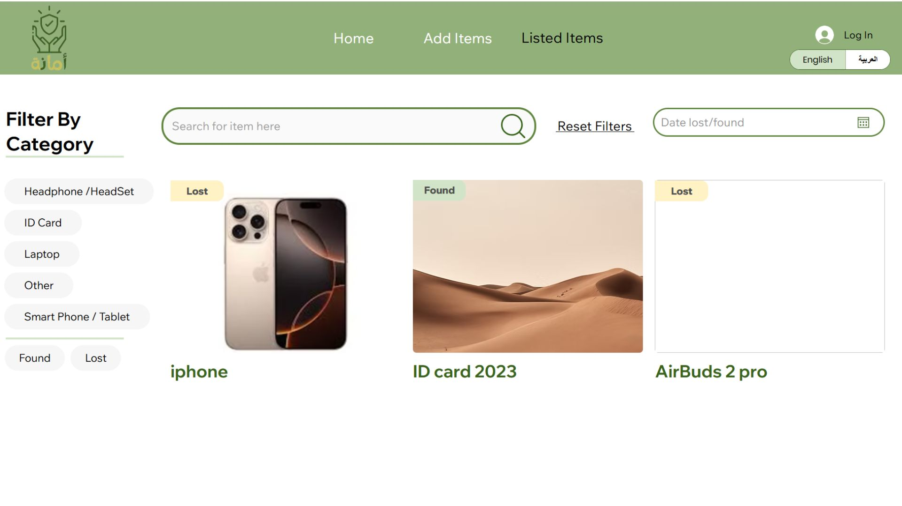
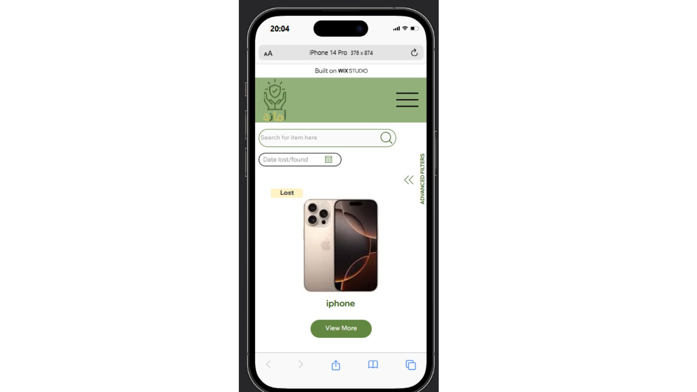
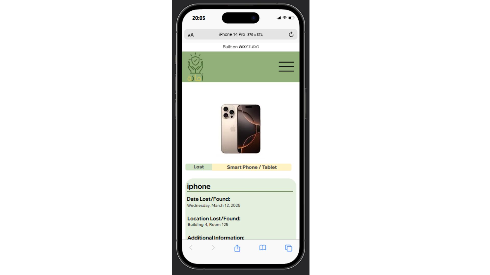

# Amanah – Lost & Found Platform

## Overview
Amanah is a web-based Lost & Found platform designed to help users report, search, and recover lost items through a centralized and structured system.

## Live Website
https://mtsat2005.wixstudio.com/amanah

## Problem
Lost items are often reported through scattered communication channels, making it difficult to track items, verify ownership, and ensure efficient recovery.

## Solution
Amanah provides a unified platform where users can report and browse items, while administrators can manage reports, monitor activity, and maintain system reliability.

## My Role
- Designed and developed the platform using Wix Studio
- Structured system flow for both users and administrators
- Built responsive layouts for desktop and mobile
- Organized content and navigation for usability
- Implemented features to support reporting and tracking workflows

## Features
- Lost and found item reporting and browsing
- Admin dashboard for tracking and managing items
- Reporting system for handling inappropriate or spam entries
- Automated email notifications:
  - Notify users with updates on their items
  - Alert administrators about potential spam or flagged content
- Responsive and user-friendly interface

## Tools Used
Wix Studio   

## Screenshots

### Home Page

### Listed Items Page

### Mobile View

## Key Learnings
This project strengthened my ability to design user-centered systems, structure workflows for both users and administrators, and implement practical features such as notification systems and moderation tools.
